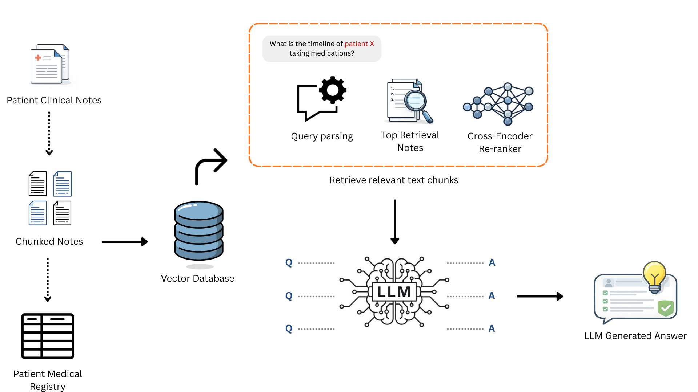

# Medical RAG

A Retrieval-Augmented Generation (RAG) system that extracts structured medication data from unstructured clinical notes.

---

## Background and solution

**Background:** Clinical notes accumulate as unstructured text across years of patient visits. Medication timelines and status labels are still extracted manually, costing clinicians 10–20 hours/week. As note volume grows, this manual process misses details and produces inconsistent, incomplete structured data — weakening downstream analyses that depend on it.

**RAG-LLM:** This project converts unstructured clinical notes into a structured medication registry, indexes it with dense embeddings and lexical search, and retrieves grounded evidence for questions such as:

- What medication did this patient take and when?
- What was the dosage of this medication?
- Is this patient's medication regimen refractory or successful?
- What is the timeline of this patient under this medication?
- How effective was this medication?
- How many times did this patient take this medication?

<div align="center">
  
</div>

---

## Data organization

### Raw data

Raw data is a folder of per-patient text files containing de-identified clinical narratives: visits, medications, seizure descriptions, EEG findings, and follow-up plans. Notes include medication frequency, side effects, treatment adjustments, discharge summaries, admission notes, and monitoring reports.

### Preprocessing and registry construction

`preprocess.py` + `build_patient_med_registry.py`:
- Read clinical text files per patient
- Clean and normalize text (redactions, unicode, medical abbreviations)
- Extract medication entities/attributes with **Med7**
- Detect seizure mentions, negation, and related symptoms with **medspaCy ConText**
- Write one row per note-medication event, attached to its source clinical note

Output: a single structured registry, `all_patients_combined.parquet`.

#### NLP libraries and extraction

**Med7** (`en_core_med7_trf`, transformer-based spaCy model) extracts medication names, dosages, frequencies, routes, and forms, populating:
- `medication` (canonical drug name)
- `medication_dosage`
- `intake_times_per_day` (derived from frequency mentions)
- `drug_mention_count`

**medspaCy** (ConText + TargetRule matcher):
- Detects seizure-related terms
- Applies negation detection to determine `seizure_status` (positive/negative/unknown)
- Aggregates `seizure_symptoms`

### Registry schema

Each row = one note-medication event:

| Column | Description |
|--------|-------------|
| `row_id` | Unique identifier for each registry row |
| `patient_id` | De-identified patient identifier |
| `note_date` | Date of the clinical note (YYYY-MM-DD) |
| `note_id` | ID for the note or encounter |
| `medication` | Canonical medication name extracted by Med7 |
| `medication_dosage` | Extracted dosage string (e.g., "500 mg") |
| `intake_times_per_day` | Times per day the medication is taken |
| `drug_mention_count` | Distinct mentions of this drug in the note |
| `medication_effectiveness` | Heuristic effectiveness assessment, if available |
| `seizure_status` | positive/negative/unknown (medspaCy ConText) |
| `seizure_symptoms` | Aggregated seizure-related symptoms from the note |
| `route` | Medication route (oral, IV, topical, ...) |
| `form` | Medication form (tablet, solution, capsule, ...) |
| `note_text` | Full text of the source clinical note |
| `extraction_context` | Local text window around the medication mention |

---

## Pipeline architecture

Raw notes → structured registry → FAISS index → multi-retriever pipeline (four backends fused via Reciprocal Rank Fusion, then cross-encoder reranked) → IR evaluation.

```
Raw Clinical Notes
          ↓
build_patient_med_registry.py
├── Med7 via medi_info_extract.py (medication extraction)
├── medspaCy ConText (seizure detection)
└── preprocess.py (text cleaning)
          ↓
all_patients_combined.parquet / .csv
          ↓
build_faiss_index.py
├── Chunk note_text (~1200 chars with overlap)
├── Embed with Bio_ClinicalBERT
└── Build faiss.index + faiss_chunk_metadata.parquet
          ↓
config/config.yaml (paths, model names, retriever toggles, fusion params)
          ↓
main_pipeline.py — Multi-Stage RAG orchestrator
├── src/data_loader.py     — candidate pool (patient/medication/date filtered)
├── src/retrievers.py      — Stage 1: parallel retrieval
│   ├── ColBERT (RAGatouille, late-interaction)
│   ├── MedCPT (dual-encoder, dot-product)
│   ├── SPECTER 2.0 (sentence embeddings, cosine)
│   ├── Contriever (sentence embeddings, cosine)
│   └── Hybrid (BM25 + Bio_ClinicalBERT, weighted fusion)
├── Stage 2: Reciprocal Rank Fusion (rrf_k=60) → top rrf_top_n candidates
└── src/reranker.py        — Stage 3: cross-encoder rerank → final_top_n results
          ↓
evaluate_metrics.py (Hit@K, P@K, R@K, NDCG@K, MRR, latency)
```

Retriever selection is config-driven: toggle backends via `retrievers.use` in `config/config.yaml`, no code changes needed.

---

## Retriever system

### Retrieval pipeline

**Models** (`config/config.yaml` → `models`):
- **ColBERTv2** (`colbert-ir/colbertv2.0`) — late-interaction retrieval via RAGatouille (off by default; unstable on newer torch)
- **MedCPT** (`ncbi/MedCPT-Query-Encoder` + `ncbi/MedCPT-Article-Encoder`) — dual-encoder, dot-product similarity
- **SPECTER 2.0** (`allenai/specter2_base`) — sentence embeddings, cosine similarity
- **Contriever** (`facebook/contriever`) — sentence embeddings, cosine similarity
- **Hybrid**: BM25 (`rank_bm25`) + `emilyalsentzer/Bio_ClinicalBERT` dense embeddings (must match `build_faiss_index.py`), min-max normalized and weighted (`hybrid_bm25_weight`, `hybrid_dense_weight`)
- **`ncbi/MedCPT-Cross-Encoder`** — final-stage reranker, joint query-chunk cross-attention

**Pipeline logic** (`main_pipeline.py::run_pipeline`):
1. **Candidate loading** (`src/data_loader.py`) filters chunks by `patient_id`, `medication`, date range
2. **Stage 1 — parallel retrieval**: each enabled backend returns its own top `per_retriever_k` ranked list
3. **Stage 2 — Reciprocal Rank Fusion**: `score(note_id) = Σ 1/(rrf_k + rank + 1)` summed across retrievers; top `rrf_top_n` unique candidates advance
4. **Stage 3 — cross-encoder rerank**: `src/reranker.py` scores each (query, chunk) pair jointly, returns top `final_top_n` with `ce_score`

### Auditability and testing

`run_pipeline` returns the full per-stage trace: `retriever_outputs` (raw per-backend hits), `fused` (RRF output with `rrf_score`/`rrf_sources`), and `final` (reranked output with `ce_score`) — every result is traceable to which retrievers surfaced it and how it ranked at each stage.

`evaluate_metrics.py` computes IR metrics (**Hit@K, Precision@K, Recall@K, NDCG@K, MRR**) plus per-stage latency (avg/p90/p99), broken out per-retriever, post-RRF, and post-rerank.

---

## Results and evaluation

### Evaluation framework

`evaluate_metrics.py` benchmarks the pipeline against the registry:
- Samples registry rows, generates templated queries (`"What is the dosage of {medication} for patient {patient_id}?"`), uses each row's `note_id` as ground truth
- Runs every enabled retriever, then RRF, then rerank, per query
- Computes Hit@K, Precision@K, Recall@K, NDCG@K, MRR
- Reports per-stage latency (avg/p90/p99)
- Writes a per-system results table to `evaluation_results.csv`

### Visualization outputs

`visualize_embeddings.py` generates evaluation and embedding-quality plots:
- Retrieval performance by query type
- Score distributions across retrieved chunks
- Score component contributions per retriever/stage
- t-SNE clustering by medication, patient, seizure status
- Retrieval quality heatmaps (similarity matrices)

### Current results

*Quantitative results from labeled evaluation datasets will be added here as the system undergoes validation.*

---

## Dependencies

- **spaCy** with `en_core_med7_trf` for medication extraction
- **medspaCy** for clinical text preprocessing and seizure detection
- **transformers** (HuggingFace) for Bio_ClinicalBERT, MedCPT, SPECTER, Contriever, and the cross-encoder
- **sentence-transformers** for SPECTER/Contriever embedding
- **ragatouille** for ColBERT late-interaction retrieval
- **FAISS** for vector similarity search
- **rank-bm25** for lexical search
- **qdrant-client** for vector storage
- **pyyaml** for configuration loading
- **pandas** and **pyarrow** for data management
- **torch** for neural model inference

See `requirements.txt` for the full pinned list.

---

## Usage

1. **Build the registry**
   ```bash
   python build_patient_med_registry.py
   ```

2. **Build the FAISS index**
   ```bash
   python build_faiss_index.py
   ```

3. **Configure the pipeline** — toggle retrievers, set model names, tune fusion params in `config/config.yaml` (see `CONFIG_GUIDE.md`)

4. **Run the pipeline**
   ```bash
   python main_pipeline.py "What is the dosage of Keppra prescribed?" --patient_id <patient_id>
   ```

5. **Evaluate**
   ```bash
   python evaluate_metrics.py --n_queries 100 --candidate_limit 500
   ```

6. **Use programmatically**
   ```python
   from main_pipeline import run_pipeline

   result = run_pipeline(
       query="What medications did this patient take in 2023?",
       patient_id="<patient_id>",
       date_start="2023-01-01",
       date_end="2023-12-31",
   )

   print(result["final"])              # reranked top results
   print(result["fused"])              # RRF-fused candidates
   print(result["retriever_outputs"])  # per-retriever raw hits
   ```

---

## Project Structure

```
LLM-RAG/
├── build_patient_med_registry.py  # Extract medications & seizures from notes
├── medi_info_extract.py           # Med7-based medication entity extraction
├── preprocess.py                  # Clinical text preprocessing
├── build_faiss_index.py           # Build vector index from registry
├── config/
│   └── config.yaml                # Paths, model names, retriever toggles, fusion params
├── src/
│   ├── utils.py                   # Config loading + path resolution + device selection
│   ├── data_loader.py             # Candidate loading (chunk parquet or registry CSV)
│   ├── retrievers.py              # MedicalRetrievers — ColBERT/MedCPT/SPECTER/Contriever/Hybrid
│   └── reranker.py                # MedicalReranker — cross-encoder reranking
├── main_pipeline.py                # Orchestrator: retrieve → RRF fuse → rerank
├── evaluate_metrics.py             # IR metrics (Hit@K/P@K/R@K/NDCG@K/MRR) + latency benchmarking
├── query_faiss.py                  # Standalone FAISS query/debug tool
├── BERT_medicalnotes.py            # Standalone Bio_ClinicalBERT entity extraction utility
├── visualize_embeddings.py         # t-SNE, similarity heatmaps, embedding QA plots
├── evaluation.ipynb                # Exploratory evaluation notebook
├── patient_files/                 # Aggregated patient context files
├── patient_notes/                 # Individual dated clinical notes
├── patient_registries/            # Generated medication registries
│   └── all_patients_combined.parquet
├── vector_index/                  # FAISS index and metadata
│   ├── faiss.index
│   ├── faiss_chunk_metadata.parquet
│   └── index_info.json
├── eval_plots/                    # Evaluation visualizations
└── old_files/                     # Superseded single-retriever architecture (kept for reference)
```

---

## License

This project is intended for research and educational purposes in clinical NLP and medical informatics.

---

## Acknowledgments

- **Med7** for medication entity recognition
- **medspaCy** for clinical NLP preprocessing and context detection
- **Bio_ClinicalBERT**, **MedCPT**, **SPECTER**, **Contriever**, and **ColBERT** for domain-specific retrieval and reranking models
- **FAISS** for efficient similarity search at scale
